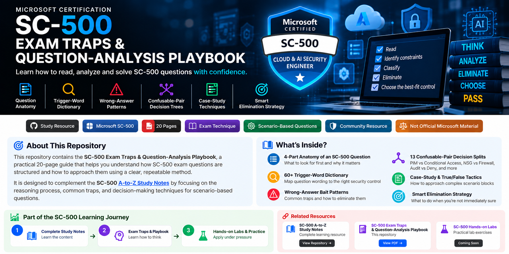
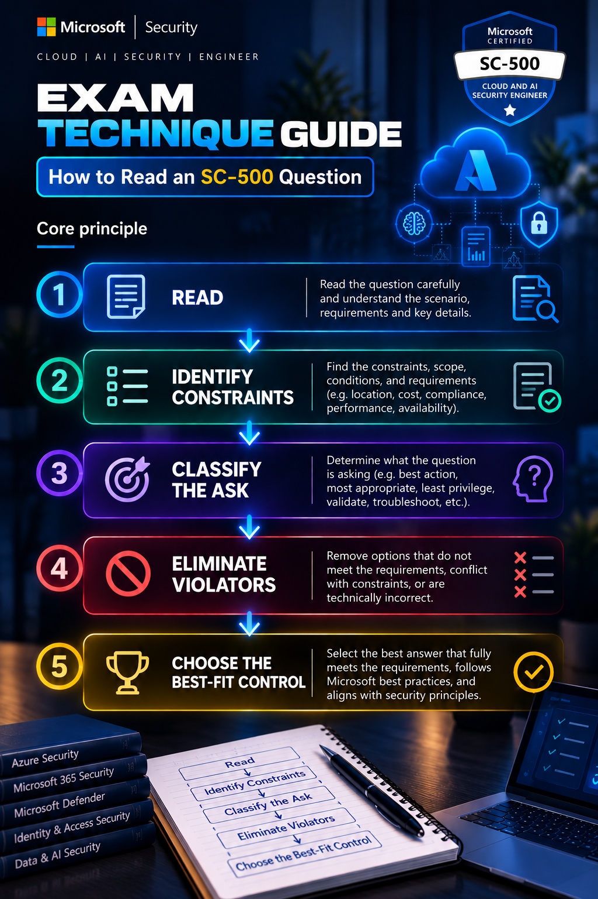
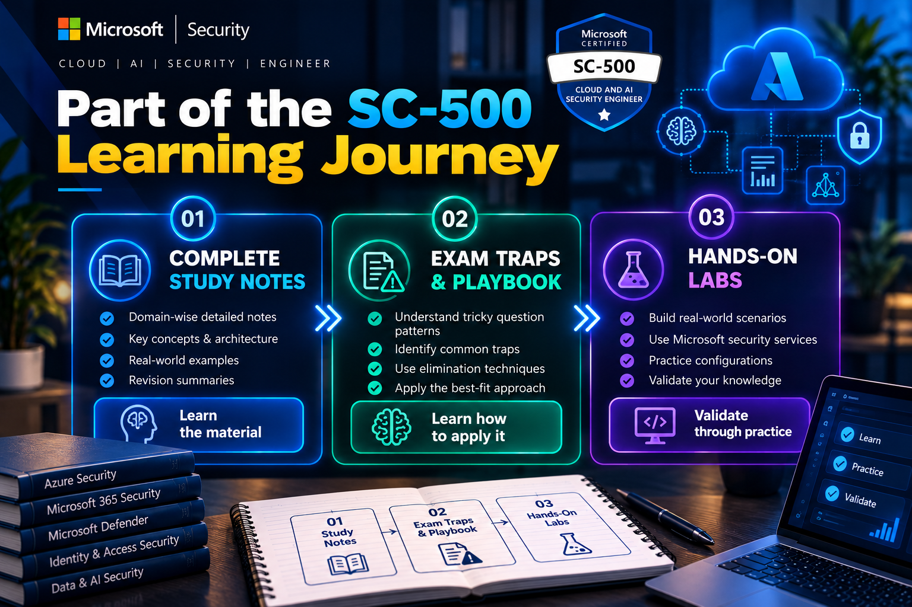
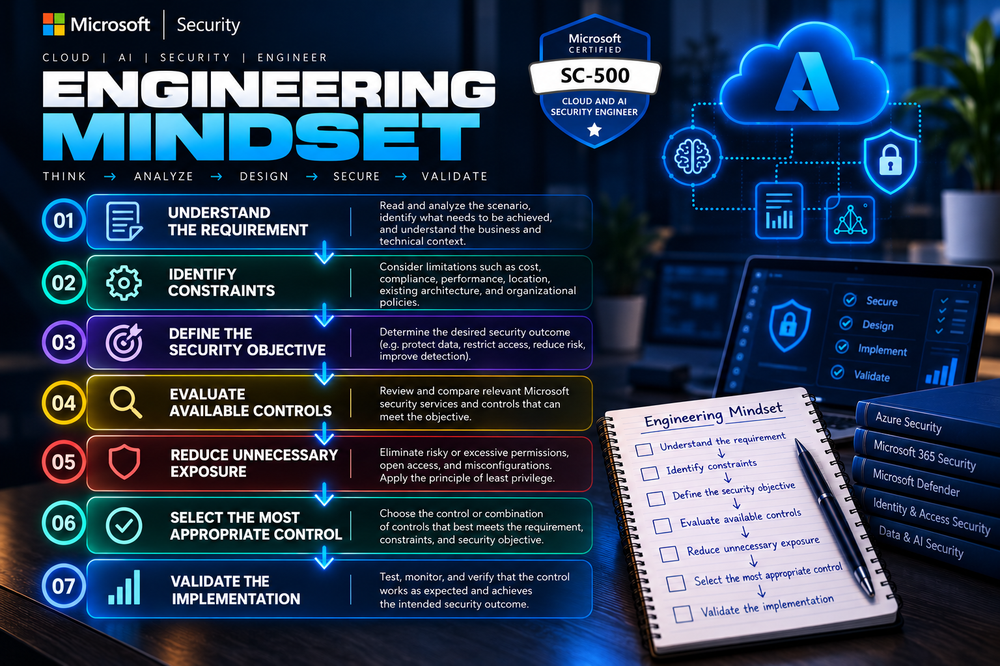

 

<h1>🧠 SC-500 Exam Traps & Question-Analysis Playbook</h1>

<h3>How to Read an SC-500 Question - And Catch the Trap Before It Catches You</h3>

A practical exam-technique guide for reading, analyzing, and solving
scenario-based Microsoft SC-500 questions under exam conditions.

 

  

<strong>Read → Identify Constraints → Classify → Eliminate → Choose</strong>

---

## 📘 About This Repository

The **SC-500 Exam Traps & Question-Analysis Playbook** is a practical
20-page study resource designed to help SC-500 candidates understand
how exam questions are structured and how to approach them using a
repeatable reasoning process.

Knowing the Azure security services is necessary - but SC-500 questions
can require you to apply that knowledge under a **specific, narrow
constraint**.

The wrong answers may represent real Azure security features while
still being the wrong choice for the scenario.

This playbook focuses on that decision-making process.

> **The goal is not simply to memorize more Azure services.**
>
> **The goal is to reason more clearly when the question gets tricky.**

---

# 🎯 Why This Guide Exists

SC-500 questions commonly combine:

- Scenario context
- Requirements
- Constraints / non-functional requirements
- A specific question or decision

The guide teaches you to separate these elements and identify which
requirements actually constrain the answer.

### Core Principle

A key technique is to eliminate options that violate the scenario
constraints **before** judging whether the remaining options are
technically correct.

---

# 🧠 What You'll Learn

## 01 - Question Anatomy

Understand the four major parts of an SC-500 question:

| Component | Purpose |
|---|---|
| Scenario / Context | Establishes the environment |
| Requirements | Defines the actual constraints |
| Constraints | Adds narrow conditions and limitations |
| The Ask | Defines what you must decide |

The guide also explains why the **ask should be identified early**
and why requirements in case studies can affect later questions.

---

## 02 - The Reading Protocol

A repeatable five-step process:

1. **Read the Ask First**
2. **Scan for Constraint Words**
3. **Classify the Ask**
4. **Eliminate Violators**
5. **Choose the Best-Fit Survivor**

Look for terms such as:

`minimum` · `least` · `without` · `cannot` · `must not` · `only` ·
`existing` · `cross-tenant` · `on-premises` · `temporary` · `permanent`

---

# 🔎 60+ Trigger-Word Mappings

The playbook contains a **60+ phrase trigger-word dictionary** that
connects common question wording with relevant security-control
categories.

### Examples

| Question wording | Direction |
|---|---|
| "least privilege" | Narrowest appropriate RBAC scope |
| "temporary elevation" | PIM eligible assignment |
| "without storing credentials" | Managed Identity |
| "shared by many resources" | User-assigned Managed Identity |
| "block deployment" | Azure Policy — Deny |
| "report only" | Azure Policy — Audit |
| "automatically fix existing resources" | DeployIfNotExists / Modify + remediation |
| "on-premises clients must connect" | Private Endpoint |
| "hide a column even from administrators" | Always Encrypted |
| "users must only see their own rows" | Row-Level Security |
| "block OWASP-style web attacks" | Web Application Firewall |
| "isolate a device / multi-step response" | Playbook |
| "automatically close noisy incidents" | Automation Rule |

The complete mappings are available in the PDF.

---

# 🚨 Wrong-Answer Bait Patterns

Common patterns include:

- Broader scope than the requirement
- Deprecated or retired functionality
- Correct feature but wrong variant
- Solving a different security problem
- Technically correct but unnecessarily complex
- Manual/custom implementation when a built-in capability satisfies
  the requirement

> **A technically valid Azure feature is not automatically the correct answer.**

The scenario requirements determine the answer.

---

# 🌳 Confusable-Pair Decision Trees

The playbook includes decision splits for commonly confused controls:

- **PIM vs Conditional Access**
- **System-assigned vs User-assigned Managed Identity**
- **Service Endpoint vs Private Endpoint**
- **NSG vs Azure Firewall**
- **Azure Firewall vs WAF**
- **Audit vs Deny**
- **DeployIfNotExists vs Append**
- **TDE vs Always Encrypted**
- **Bastion vs JIT VM Access**
- **Automation Rule vs Playbook**
- **Foundational CSPM vs Defender CSPM**
- **Entra Private Access vs VPN**

---

# 🧪 Case-Study Tactics

The guide covers:

- Reading the case overview carefully
- Identifying existing infrastructure
- Tracking technical and business requirements
- Identifying explicitly forbidden options
- Reusing case constraints across later questions
- Handling True / False scenario blocks
- Checking resource, subscription, and tenant scope

A statement can be technically true in general but still be **false
for the specific case** because the scenario has ruled out that option.

---

# 🎯 Smart Elimination Strategy

When you don't immediately know the answer, eliminate options that:

❌ Violate an explicit requirement  
❌ Use the wrong scope  
❌ Solve a different problem  
❌ Depend on deprecated functionality  
❌ Require unnecessary manual work  
❌ Introduce unnecessary standing credentials

Then compare the remaining options against the scenario.

---

# 📚 Part of the SC-500 Learning Journey

  
 

---

# 📥 Download the Playbook

### 📘 Complete 20-Page PDF

[**Download the SC-500 Exam Traps & Question-Analysis Playbook →**](./SC-500-Exam-Traps-Question-Analysis-Playbook.pdf)

---

# 🔗 Related Resources

### 📘 SC-500 A-to-Z Study Notes

Complete SC-500 study resource covering cloud security, identity,
AI security, detection, response, and exam-focused preparation.

🔗 **Repository:**  
https://github.com/AmalUBasnayake/SC-500-Cloud-AI-Security-Engineer-Master-Guide

---

### 🧪 SC-500 Hands-on Security Labs

Practical Azure, Microsoft Sentinel, Defender, Entra ID, AI Security,
and cloud-security labs designed to complement the study resources.

🔗 **GitHub:**  
https://github.com/AmalUBasnayake

---

### 🌐 Amal Cyber Lab - Security Portfolio

Explore the broader cybersecurity portfolio, including Azure Security,
Cloud & AI Security, SIEM/SOC, Microsoft Security, AI Security,
and hands-on engineering projects.

🔗 **Portfolio:**  
https://amalcyberlab.vercel.app

---

# 🛡️ Engineering Mindset

  
 

**Exam technique → Security engineering thinking**

---

# 👤 Author

### Amal Udayanga Basnayake

**IT & Systems Specialist | Cybersecurity | Cloud & AI Security**

Amal Udayanga Basnayake is an IT & Systems Specialist focused on
cybersecurity, Azure security, cloud security, Microsoft security,
SIEM/SOC operations, and AI security engineering.

He builds practical security labs, study resources, and engineering
playbooks focused on turning cybersecurity concepts into hands-on,
scenario-driven security practice.

### 🎓 Education

- **BSc (Hons) Cyber Security (Top-Up)** - University of Wolverhampton  
  *In Progress*
- **BTEC HND Cybersecurity** - Pearson

### 🔗 Connect

---

# ⚠️ Disclaimer

This is an **independent study resource** created for SC-500
certification preparation.

This project is **not affiliated with, sponsored by, or endorsed by
Microsoft**.

This guide does not reproduce official Microsoft exam questions and is
intended only as a study and exam-technique resource.

---

### 🔒 Systems: Secured.
### 🧠 Mindset: Focused.
### 🛡️ Future: Encrypted.

**Built as part of Amal Cyber Lab**

